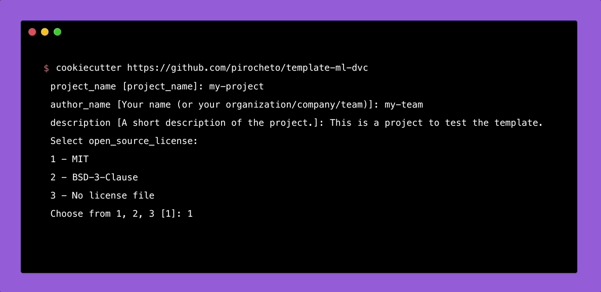
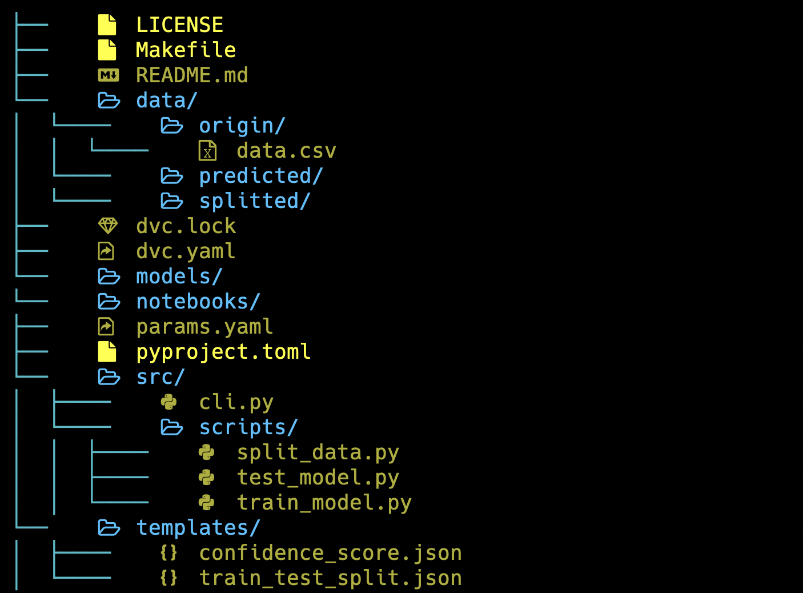

# Template for modern machine-learning project

[](https://cookiecutter.readthedocs.io/en/stable/)
[](https://dvc.org/doc)

This repository is a cookiecutter template for a machine learning project with DVC. The aim is to provide a starting point for new projects and to encourage consistency across projects by providing a structure and common tools.

## What is [DVC](https://dvc.org/doc) ?

DVC (Data Version Control) is an open-source version control system for machine learning projects and data science workflows. It helps to manage and track the changes in the data and the code, including data files and models, and enables collaboration and reproducibility of experiments. DVC helps to manage the lifecycle of the data and the models, including data processing, experimentation, and deployment.

## Getting Started

### Prerequisites

This template is build to work with [cookiecutter](https://cookiecutter.readthedocs.io/en/stable/).
You can check if it is correctly install on your system with the command below.

```bash
cookiecutter --version
```

If you need, you can find the installation instructions [here](https://cookiecutter.readthedocs.io/en/stable/installation.html).

### Usage



1. Run cookiecutter to generate the project.
   ```bash
   cookiecutter https://github.com/pirocheto/template-ml-dvc
   ```
2. Answer the questions prompted by cookiecutter. For example:

   ```bash
   project_name [project_name]: my-project
   repo_name [my-project]: my-repo
   author_name [Your name (or your organization/company/team)]: my-team
   description [A short description of the project.]: This is a project to test the template.
   Select open_source_license:
   1 - MIT
   2 - BSD-3-Clause
   3 - No license file
   Choose from 1, 2, 3 [1]: 1
   ```

3. The template will create a new directory with the specified project name, containing the necessary components for a machine learning project with mlflow.

> **NOTE**: Next time, you will able to run the command with the model name only because cookicutter will have already downloaded all the necessary files.
>
> ```bash
> cookiecutter template-ml-dvc
> ```

<html src>

## Tools used in this project

### Summary

- DVC: Data version control
- Poetry: Dependency management
- pre-commit plugins: Automate code reviewing formatting
- Make & Makefile: Create short and readable commands for repeatable tasks

### Details

- DVC

  DVC (Data Version Control) is an open-source version control system for machine learning projects and data science workflows. It helps to manage and track the changes in the data and the code, including data files and models, and enables collaboration and reproducibility of experiments. DVC helps to manage the lifecycle of the data and the models, including data processing, experimentation, and deployment.

- Poetry

  Poetry is a package and dependency management tool for Python programming language. It allows developers to easily manage packages, create virtual environments, and define the dependencies for their projects, making it easier to manage and share them with others. It aims to provide a simpler and more organized way of handling Python projects compared to using pip and requirements files.

- pre-commit

  pre-commit is a framework for managing and maintaining project-level Git hooks. Git hooks are scripts that run automatically whenever certain events occur in a Git repository, such as committing or merging code. pre-commit allows developers to define a set of checks and validations that should be run before code is committed, ensuring that code is formatted correctly, all tests pass, and any other required criteria are met. By running these checks as Git hooks, pre-commit helps to maintain the quality of the codebase and avoid simple mistakes from being committed.

- Make

  Make was originally designed as a tool to convert source code into executable binaries. If you have ever built a library directly from source code, chances are you have used it. In contemporary machine learning projects, the need for compiling source code is limited, and instead, we suggest utilizing it to enhance the command-line interface of the ML project.

### Structure



## License

Distributed under the MIT License. See [LICENSE](./LICENSE) for more information.

## References

- cookiecutter: https://cookiecutter.readthedocs.io/en/stable/
- DVC: https://dvc.org/doc

<div align="center">


</div>
