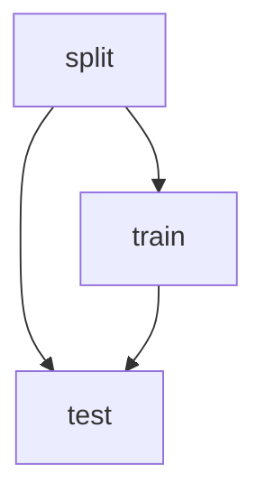

# {{ cookiecutter.project_name }}

## Getting Started

### Prerequisites

#### Tools

- [Make](https://www.gnu.org/software/make/manual/make.html)
- [Poetry](https://python-poetry.org/docs/)

## Usage

1. Install the python dependencies

   ```bash
   make install
   ```

2. Run an experiment

   ```bash
   make run
   ```

### DAG



## License

Distributed under the {{ cookiecutter.open_source_license }} License. See [LICENSE](./LICENSE) for more information.

## References

- DVC: https://dvc.org/doc
- Poetry: https://python-poetry.org/docs/
- Make: https://www.gnu.org/software/make/manual/make.html
